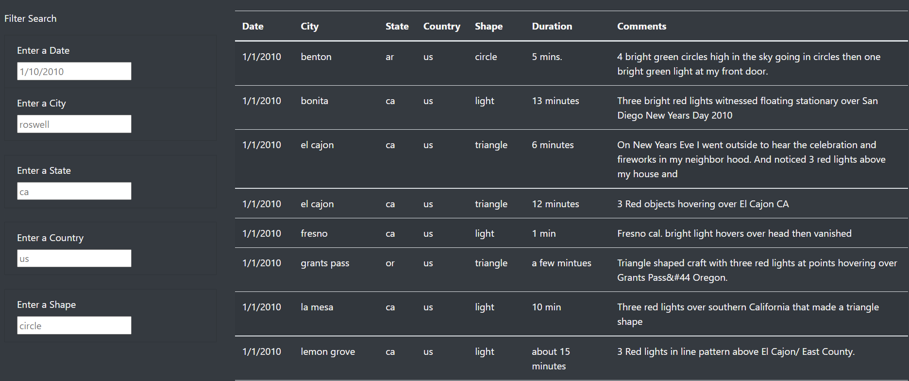
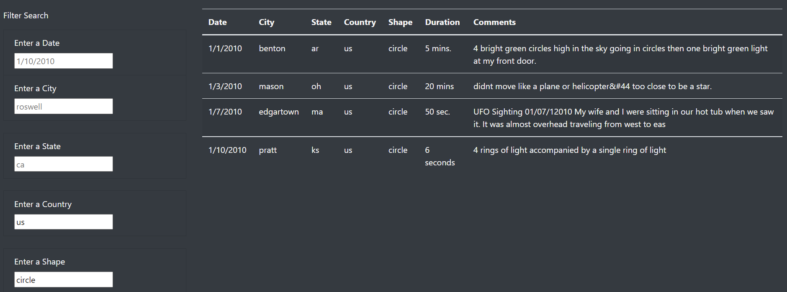

# Challenge 11

## Overview of the Project

Dana is a Data Journalist who likes to write about her hometown McMinnville Oregon and the UFOs' sightings, she wants to present her newest UFO's article  and include the chance for the readers to review, in a dynamic way, the information related to sightings. 

For this project, we used a mix of HTML, Bootstrap, and CSS to create a web page hosting the article and providing access to the database through a dynamic table that allows the user to filter the information to show his preference.   

## Results

After some coding and graphic design, Article's home page looks like this: 

Right below the article, our source of information can be found: 

Note the first column got input boxes that can be used by the user to request to pull the information filtered by Date, City, State, Country, and Shape, usage is pretty straightforward and just needs to input a valid argument to display the filtered information.

A first filter at city (City= "Benton") would look like this: 

Multiple filters can be used at the same time as follows (Country= "us" & Shape= "Circle"): 

## Summary

This is an excellent easy source of information for users but probably is just a one-timmer use web page since although the information is presented in a dynamic way, the source is static, meaning is not updated as new sightings occur. For now, the same is true for the written information. 

If we want the users to frequently revisit the page we need to include in future developments: 

1) Periodical update of the basis. 
2) New articles must be updated at the page. 
3) Different information can be included for users' interest (images, directions to interest sites, etc.)
