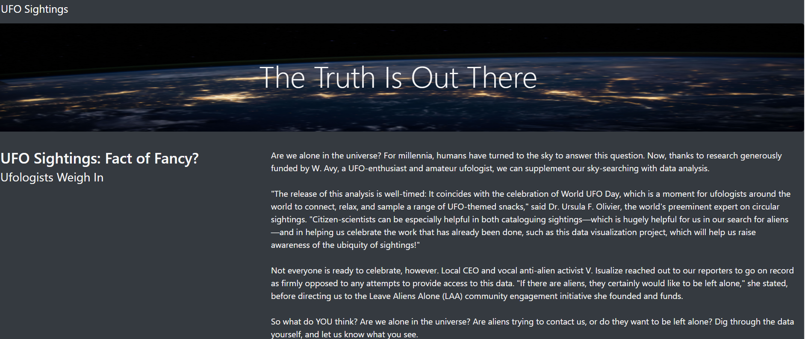
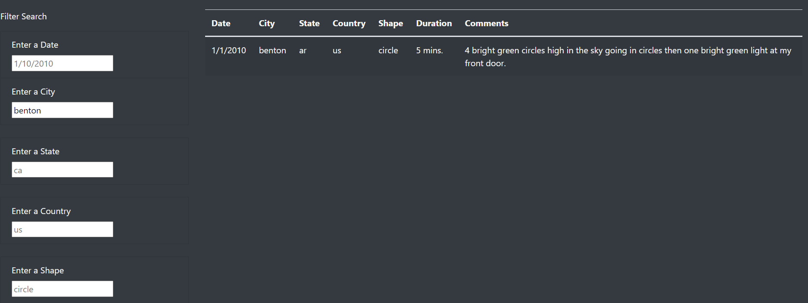
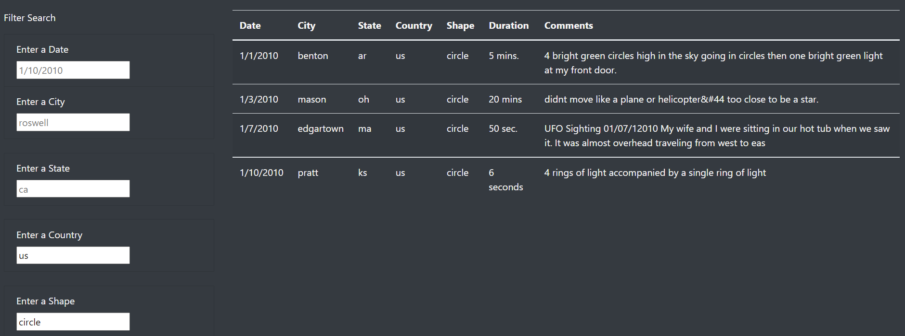

# Challenge 11

## Overview of the Project

Dana is a Data Journalist who likes to write about her hometown McMinnville Oregon and the UFOs' sightings, she wants to present her newest UFO's article  and include the chance for the readers to review, in a dynamic way, the information related to sightings. 

For this project, we used a mix of HTML, Bootstrap, and CSS to create a web page hosting the article and providing access to the database through a dynamic table that allows the user to filter the information to show his preference.   

## Results

After some coding and graphic design, Article's home page looks like this: 

Right below the article, out source of information can be found: 

Note first column got input boxes that can be used by the user to request to pull the information filtered by Date, City, State, Country, and Shape, usage is pretty straight forward and just needs to input a valir argument to display the filtered information.

A first filter at city (City= "Benton") would look like this: 

Multiple filters can be used at the same time as follows (Country= "us" & Shape= "Circle"): 

## Summary

In a summary statement, describe one drawback of this new design and two recommendations for further development.
